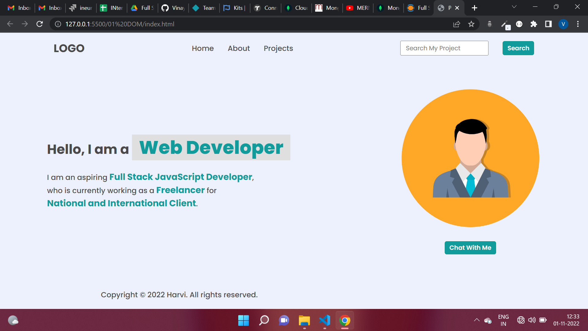

# First Assignment
## Home

## Task 1


### i)Changing the 3rd list item from contact to Projects
### Solution
```
let list = document.getElementsByTagName("ul")
console.log(list[0])

list[0].appendChild(document.createElement("li")).innerText = "hire me"


```
### adding new list item
```
let search= document.querySelector(".search-field")
search.firstElementChild.value = "Search My Project"
```


## Task 2


### Changing the Search button placeholder
### Solution
```
let search_field = document.querySelector(".search-field");
let input_box = search_field.querySelector("input");
input_box.placeholder = "Search My Project";
```

## Task 3


### Changing the paragraph text oh hero-left-section
### Solution
```
let span = document.getElementsByTagName("span")
console.log(span)
span[3].innerText = "ineuron intelligence pvt. ltd."
span[2].innerText = "an employee"
```

## Task 4


### Adding Image
### Soltuion
```
const IMAGE = document.querySelector('.hero-right-section img')

IMAGE.src = './goku.jpg'
```

## TASK 5


### Adding a Support Me button
### Solution
```
let button = document.querySelector(".hero-right-section-btns")
button.appendChild(document.createElement("button")).innerText = "Support me"
```
